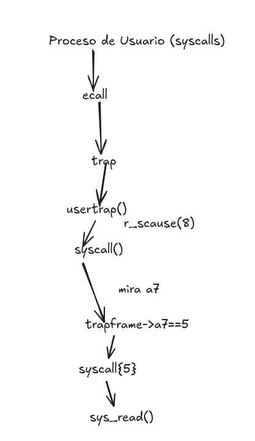
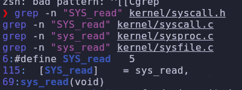
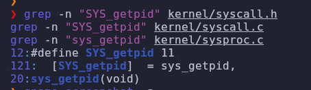

# Sistemas operativos - xv6 (practica 2)

---
Esta imagen es un resumen de todo lo que se hace cuando haces una syscall al kernel que en este caso es xv6.
En resumen es importante usar un trapframe , para que al momento de terminar el ecall la aplicaciòn siga funcionando con normalidad ya que el *trapframe* es importante por que ahi se guarda los estados de xv6 cuando ocurre un trap. 

Entre los registros que se guardan se encuentra a7 que este conntiene el numero de la llamada al sistema pero antes *usetrap* usa otra funciòn muy importante llamada **rscause()=8** 8 es para decir que ocurrio un llamado  al sistema.Entonces como esta en el grafico se ejecuta *syscall()* que obtiene desde p->frame->a7 el nùmero de syscal l para determinar que funcion se ejecuta.

---
con respecto a por que algunos syscall estan en sysproc.c o sysfile.c como veremos a continuaciòn:

Es por que otros trabajan con gestiòn de procesos como getpid , mientras que sysfile.c contiene llamadas relacionadas con  operaciones de entrada y salida y obiamente ambos usan trap y trapframe.

--- 
El número de la llamada al sistema se transmite mediante el registro `a7` porque los registros del procesador permiten pasar esta información directamente durante la ejecución de la llamada. Antes de ejecutar `ecall`, el programa coloca en `a7` el número de la syscall que desea realizar. Cuando ocurre el trap, xv6 guarda los registros del proceso en el `trapframe`, incluyendo el valor de `a7`. De esta manera, el kernel puede obtener posteriormente el número mediante `p->trapframe->a7` y utilizarlo para seleccionar la función correspondiente en la tabla de despacho. Una variable compartida en memoria no sería necesaria para este mecanismo, ya que los registros proporcionan una forma directa y establecida de pasar los datos de la syscall.

---
Con respecto a que pasa si dos procesos son llamados a la vez pws xv6 ,cada proceso tiene su propia estructura proc y su propio trapframe, Aqui entra otro concepto importante que es el scheduler por lo qu epudeinvestigares quien se encarga de decir cual proceso se ejecuta o cuando cambiar de proceso.
